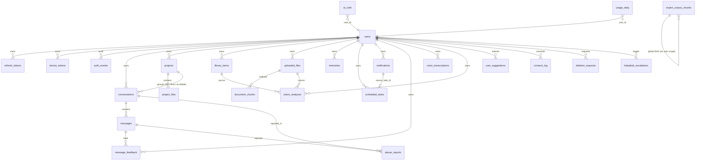

# Data Model — NEXYA Backend

> **Executive summary (EN).** PostgreSQL 16 with `pgvector` (memory +
> RAG) and `pg_trgm` (FTS French) extensions. 19 migrations cumulative
> (Alembic). 22 user-scope tables + 4 system tables. Soft-delete pattern
> with `deleted_at` + partial indexes `WHERE deleted_at IS NULL` for
> active-row hot paths. Cursor-based keyset pagination on user-scope
> lists. `JSONB` for flexible metadata. Foreign keys: `CASCADE` for
> child entities, `SET NULL` for RGPD-safe forensic preservation.

> Source de vérité du schéma : [`schema.sql`](schema.sql) exporté via
> `bash scripts/export_schema.sh`.

---

## Diagramme ER simplifié



---

## Tables principales

### Auth & Users

| Table | Lignes attendues | Index critiques |
|---|---|---|
| `users` | 950k cible | `email UNIQUE`, `username UNIQUE`, `created_at DESC` |
| `refresh_tokens` | ~5M (rotation 30j) | `(user_id, expires_at) WHERE revoked_at IS NULL` |
| `device_tokens` | ~1M | `(user_id, is_active)`, FCM lookup |
| `device_quotas` | ~5M (1/jour/device) | PK composite `(device_id, date_utc)` |
| `auth_events` | ~50M (forensic 2 ans) | `(event_type, created_at DESC)`, `(user_id, created_at DESC)` |

### Chat & Conversations

| Table | Lignes attendues | Index critiques |
|---|---|---|
| `conversations` | ~50M | `(user_id, last_message_at DESC) WHERE deleted_at IS NULL`, FTS GIN trigram sur `title` |
| `messages` | ~500M | `(conversation_id, created_at, id)`, GIN tsvector french |
| `abuse_reports` | ~10k | `(user_id, message_id) UNIQUE` anti-doublon |
| `message_feedback` | ~5M | `(user_id, message_id) UNIQUE`, `(message_id, rating)` agrégat |

### Projects, Library, Files

| Table | Lignes attendues | Index critiques |
|---|---|---|
| `projects` | ~5M | `(user_id, LOWER(name)) UNIQUE WHERE deleted_at IS NULL`, GIN trigram name |
| `project_files` | ~25M | `(project_id, uploaded_at DESC) WHERE deleted_at IS NULL` |
| `library_items` | ~50M | `(user_id, content_sha256) UNIQUE WHERE deleted_at IS NULL` dédup |
| `uploaded_files` | ~50M | UNIQUE partial dédup SHA cross-feature, `WHERE attached_at IS NULL` cron cleanup |
| `document_chunks` | ~500M | HNSW `vector_cosine_ops` 1536 dim, `UNIQUE (file_id, chunk_index)` |

### Mémoire IA & RAG

| Table | Lignes attendues | Index critiques |
|---|---|---|
| `memories` | ~95M (100/user free) | HNSW vector 1536 dim, `(user_id, content_sha256) UNIQUE WHERE deleted_at IS NULL` |
| `expert_corpus_chunks` | ~50M (global, pas user-scope) | HNSW vector 768 dim Gemini |

### Multimedia

| Table | Lignes attendues | Index critiques |
|---|---|---|
| `voice_transcriptions` | ~10M | UNIQUE partial dédup `(user_id, content_sha256)` |
| `vision_analyses` | ~20M | UNIQUE partial dédup `(user_id, image_sha256, prompt_sha256)` |

### Planner & Notifications

| Table | Lignes attendues | Index critiques |
|---|---|---|
| `scheduled_tasks` | ~5M | `(updated_at) WHERE active AND NOT paused AND next_run_at <= NOW()` queue |
| `scheduled_task_results` | ~50M | `(task_id, ran_at DESC)`, retention 30j cron |
| `notifications` | ~500M | `(user_id, created_at DESC) WHERE read_at IS NULL AND deleted_at IS NULL` |
| `notification_preferences` | ~5M | PK composite `(user_id, category)` |

### Observabilité IA

| Table | Lignes attendues | Index critiques |
|---|---|---|
| `ai_calls` | ~5G (1 par message) | `(user_id, created_at DESC)`, `(legal_basis, created_at DESC)` AI Act |
| `usage_daily` | ~350M (1/user/jour × 1 an) | PK composite `(user_id, date_utc)` |

### RGPD & Compliance

| Table | Lignes attendues | Index critiques |
|---|---|---|
| `consent_log` | ~10M | `(user_id, consent_type) UNIQUE WHERE status='granted' AND revoked_at IS NULL` actif |
| `deletion_requests` | ~50k/an | `(user_id, status) WHERE status IN ('pending','processing')` UNIQUE idempotence |

### Helpdesk (Phase 18)

| Table | Lignes attendues | Index critiques |
|---|---|---|
| `helpdesk_escalations` | ~100k/mois | `(severity, created_at DESC) WHERE status='open' AND severity IN ('high','critical')` queue admin |

### System

| Table | Rôle |
|---|---|
| `alembic_version` | Pointeur migration courante (`SELECT version_num` lu par `/ready`) |

---

## Conventions

### Soft-delete + partial index
Pattern systématique sur les tables user-scope :

```sql
ALTER TABLE projects ADD COLUMN deleted_at TIMESTAMPTZ;
CREATE INDEX ix_projects_user_active
    ON projects (user_id, created_at DESC)
    WHERE deleted_at IS NULL;
```

Le hot path (liste active user) lit l'index partiel — rapide même quand
la corbeille a 100k entrées historiques.

### Cursor-based pagination
`(created_at, id)` keyset cursor base64url, pattern aligné sur `tuple_()`
SQLAlchemy natif. Évite le coût `OFFSET` qui scale O(n).

### JSONB flexible
`metadata_json` / `payload_json` / `data_json` en `JSONB` pour
metadata évolutive sans migration. Anti-pattern : champ dédié pour
chaque métadonnée → migrations infinies.

### FK CASCADE vs SET NULL

| Cas | Choix | Exemple |
|---|---|---|
| Entité enfant inutile sans parent | `CASCADE` | `messages.conversation_id` |
| Trace forensic à conserver post-purge user | `SET NULL` | `auth_events.user_id`, `helpdesk_escalations.user_id` |
| RGPD : anonymisation logique | `SET NULL` | `user_suggestions.user_id` |

### Dédup SHA-256
Pattern UNIQUE partial pour idempotence sur ré-upload :

```sql
CREATE UNIQUE INDEX uq_library_user_sha_active
    ON library_items (user_id, content_sha256)
    WHERE deleted_at IS NULL;
```

---

## Migrations

19 migrations cumulatives (`migrations/versions/`) :

| # | Migration | Date | Contexte |
|---|---|---|---|
| 001 | auth tables | 2026-04-18 | users, refresh_tokens, device_tokens |
| 002 | chat tables | 2026-04-21 | conversations, messages, abuse_reports |
| 003 | auth hardening | 2026-04-22 | device_quotas, auth_events |
| 004 | ai_calls + usage_daily | 2026-04-22 | observabilité IA cost |
| 005 | FTS search | 2026-04-23 | pg_trgm + tsvector french |
| 006 | projects | 2026-04-24 | projects, project_files |
| 007 | library | 2026-04-24 | library_items |
| 008 | uploaded_files | 2026-04-24 | files upload pipeline |
| 009 | memories | 2026-04-24 | pgvector mémoire IA |
| 010 | memory extracted sentinel | 2026-04-24 | extraction post-conv |
| 011 | document_chunks | 2026-04-24 | RAG documents |
| 012 | voice_transcriptions | 2026-04-24 | STT Pro |
| 013 | vision_analyses | 2026-04-24 | multimodal |
| 014 | scheduled_tasks | 2026-04-24 | Planner F1 |
| 015 | notifications | 2026-04-25 | F3 |
| 016 | expert_corpus_chunks | 2026-04-26 | RAG experts (G1) |
| 017 | rgpd consent + deletion | 2026-04-26 | J1 |
| 018 | message_feedback + suggestions | 2026-04-27 | N1 |
| 019 | helpdesk escalations | 2026-04-27 | N4 |

Réversibilité : `alembic downgrade -1` testé en CI L1 (cf.
`.github/workflows/ci.yml::migrations-check`).

---

## Volumétrie projetée 950k users

Sur 1 an de prod régime (estimation) :

- `messages` : ~500M lignes (~1 To avec content + tsvector)
- `ai_calls` : ~5 milliards lignes (1 par message + retries) — partitionnable
- `notifications` : ~500M lignes (cron purge resolved > 90j)
- `document_chunks` : ~500M (50/file × 50k files actifs)

**Plan de scaling V2 (post-launch)** :
- Partitioning `ai_calls` par mois (déjà documenté Phase 19 multi-region)
- Read replica Postgres pour analytics
- Archive S3 pour `messages` > 1 an

Voir [`docs/runbooks/db-restore.md`](../runbooks/db-restore.md) pour la
procédure backup + restore.
