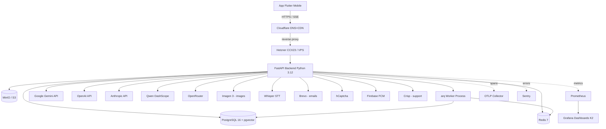

# Architecture Overview — NEXYA Backend

> **Executive summary (EN).** NEXYA backend is a Python 3.12 / FastAPI
> async monolith serving an AI assistant mobile app (Flutter, target
> 950k users in French-speaking Africa). SSE-streamed chat with 11
> domain experts routed across 4 LLM providers (Gemini/OpenAI/Anthropic
> /Qwen) + image generation (Imagen) + voice (Whisper STT, OpenAI TTS)
> + vision (multi-modal). PostgreSQL 16 + pgvector (memory & RAG) +
> Redis 7 (cache, rate limit, SSE cancel) + MinIO/S3 (uploads).
> Background workers via `arq`. Observability stack OpenTelemetry +
> Sentry + Prometheus + Grafana. RGPD UE 2016/679 + AI Act EU 2024/1689
> compliant. Mock-first SaaS pattern (8 integrations: Brevo, hCaptcha,
> FCM, Vision, Voice, Embeddings, Crisp, MinIO).

---

## Vision en une phrase

NEXYA backend = **API REST + SSE qui décide du modèle IA** (jamais le
frontend) selon le `expert_id` envoyé par l'app, applique des
garde-fous économiques et sécuritaires (rate limits, budget tokens,
modération métier, captcha, JWT RS256), et émet en streaming la
réponse au mobile via SSE compatible 2G/3G.

---

## Diagramme global

---

## Couches applicatives

### 1. **Routing HTTP** (FastAPI)

- Versioning : V1 unprefixé (cf. [`docs/api/versioning.md`](../api/versioning.md))
- Auth : JWT RS256 via `Depends(get_current_user)`
- Rate limiting : Redis sliding window par user + par IP
- 60+ endpoints documentés OpenAPI 3.1 (cf. [`docs/api/openapi.json`](../api/openapi.json))
- Middlewares ordonnés (Starlette LIFO) :
  1. `NexyaSecurityHeadersMiddleware` (CSP/HSTS/COOP selon preset O1)
  2. `TraceIdMiddleware` (X-Request-ID + structlog corrélation)
  3. `CORSMiddleware`

### 2. **Couche IA**

Cœur produit : `app/ai/`. Voir [`ai-architecture.md`](ai-architecture.md) pour le détail.

- `LlmRouter` résout `expert_id → ChatResolution(provider, model, config)`
- 11 `ExpertConfig` (general, computer, science, finance, language,
  cooking, studio, engineering, productivity, medicine, legal)
- 4 chat providers réels + Mock usurpant identité : Gemini /
  OpenAI / Anthropic / Qwen / OpenRouter / **MockChatProvider**
- Résilience : `RetryPolicy` + `CircuitBreaker` + fallback chain
- Économie : `BudgetTracker` Redis + `PromptCache` Redis +
  `TokenEstimator` tiktoken
- Sécurité : `ModerationService` (OpenAI omni) +
  `moderation_rules.check_business_rules` (regex métier)

### 3. **Persistance**

- **PostgreSQL 16 + pgvector** : 19 tables (cf. [`data-model.md`](data-model.md))
  + extension `vector` pour mémoire IA + RAG documents
  + extension `pg_trgm` pour FTS française (titre conversations)
- **Redis 7** : sessions JWT blacklist + rate limit sliding windows
  + `chat:cancel:{session_id}` SSE cancel + `arq:queue` jobs +
  `prompt_cache:*` réponses LLM cachées 24h + `ai:session:*` SessionStore
- **MinIO/S3** : library items + uploaded files + sharding 2-char SHA
  + presigned URLs TTL 1h (jamais storage_key brut exposé)

### 4. **Workers async**

`arq` workers consomment Redis queue + crons :

- `cleanup_refresh_tokens` (3h17 UTC)
- `flush_ai_sessions` (toutes les 10 min — filet sécurité fast path
  CostTracker)
- `dispatch_due_tasks` (chaque minute — Planner)
- `cleanup_old_task_results` (4h23 UTC)
- `purge_deleted_accounts` (3h47 UTC — RGPD workflow 2-step)
- `extract_durable_facts` (one-shot post-conversation)
- `index_document_chunks` (sémaphore Redis par user)
- `generate_conversation_title` (one-shot post-stream)

### 5. **Observabilité** (Stack K1+K2)

- **OpenTelemetry** auto-instrumentation FastAPI / SQLAlchemy / httpx
  / Redis + spans manuels critiques (`ai.chat.stream`, `tools.run`,
  `notifications.dispatch`, `arq.{function}`)
- **Sentry** env-aware (DSN vide = init pas appelé) + scrubber A3 +
  filtres `CancelledError`/`NexYaException`
- **Prometheus** 14 métriques NEXYA custom + endpoint `/metrics`
  token-protégé + buckets latence Africa-friendly (50ms→60s)
- **Grafana** 5 dashboards provisionnés UIDs stables + 6 alertes
  (5xx rate, chat latency, breaker open, FCM failure, arq failure,
  cost USD daily)
- **structlog** JSON logs corrélés par `trace_id` + `span_id` injectés

---

## Décisions structurantes

Voir [Architecture Decision Records](../adr/) :

- [ADR 0001](../adr/0001-fastapi-vs-django.md) — FastAPI vs Django
- [ADR 0002](../adr/0002-sqlalchemy-async.md) — SQLAlchemy 2.0 async
- [ADR 0003](../adr/0003-redis-rate-limiting.md) — Redis sliding window
- [ADR 0004](../adr/0004-jwt-rs256-vs-hs256.md) — JWT RS256 asymétrique
- [ADR 0005](../adr/0005-llm-router-mock-first.md) — LlmRouter mock-first

---

## Cibles SLO

Voir [N4 thresholds](../../tests/load/thresholds.json) pour les seuils
codifiés. Cibles principales :

| Endpoint | p95 |
|---|---|
| `/auth/login` | < 500ms |
| `/chat/stream` (premier token) | < 2s |
| `/chat/stream` (total) | < 30s |
| `/files/upload` (1MB) | < 3s |
| `/chat/conversations` (paginé) | < 300ms |
| `/metrics` (scrape Prometheus) | < 100ms |

Erreur globale < 1%. Vérifié hebdomadairement par k6 cron Sunday 4h UTC.

---

## Coût opérationnel

| Catégorie | Estimation prod régime |
|---|---|
| Hetzner CCX23 (Postgres + Redis + Backend) | ~50 EUR/mois |
| OpenAI (modération + embeddings) | ~$50/mois (mock-first dev) |
| Gemini (chat principal) | ~$300/mois @ 950k users régime |
| Brevo (emails) | $25-100/mois |
| Sentry (free tier 5k events/mois) | $0 → ~$26/mois post-launch |
| Évals IA nightly (N3) | ~$30/mois |
| Crisp (support free tier) | $0 → $25/mois pro plan |

Non inclus : phase fine-tuning Gemma (GPU Hetzner H100 ~$2/h ponctuel).

Voir [`BACKEND_IA_NEXYA.md`](../../BACKEND_IA_NEXYA.md) section coûts pour
projection détaillée.

---

## Roadmap résumée

État au 2026-04-27 (post-O2) :

- ✅ Phase 1-7 livrées (auth + IA + chat + history + projects + files +
  voice + vision + library + memory + RAG)
- ✅ Phase 8 partielle (planner F1, notifications F2/F3, deep linking)
- ✅ Phase 13-14 (observabilité K1+K2, CI/CD L1, RGPD J1)
- ✅ Bloc N (tests N1+N2+N3 évals + N4 load)
- ✅ Bloc O (OpenAPI O1 + DD-ready O2)
- 🔧 Phase 11 (paiements I1/I2/I3) — placeholder doc, code à venir
- 🔧 Phase G (RAG corpus G2-G7 experts spécialisés)
- 🔧 Phase H (fine-tuning Gemma langues camerounaises)
- 🔧 Phase L2/L3/L4 (déploiement staging + prod + observabilité prod)
- 🔧 Phase 19 (pentest M1 + DPIA M3)

Voir [`docs/ROADMAP.md`](../ROADMAP.md) pour le détail.
