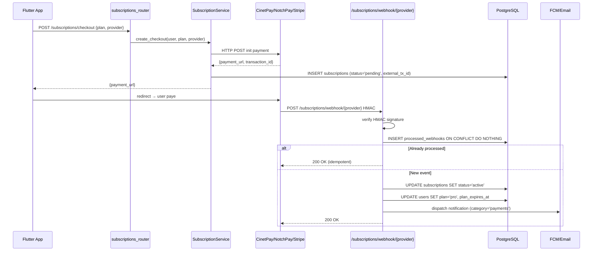

# Payments Readiness — NEXYA Backend

> **Executive summary (EN).** Architecture placeholder for Phase 11 (I1/
> I2/I3). NEXYA targets African mobile money (CinetPay aggregator:
> Orange Money + MTN + Wave + Airtel) + alternative NotchPay + Stripe
> for diaspora cards. Webhook idempotent pattern with HMAC validation
> + dedup table `processed_webhooks`. Subscription model: monthly
> Pro plan only V1, wallet/pay-as-you-go V2 post 10k+ paying users.
> NOT IMPLEMENTED in code yet — this doc documents the architectural
> readiness so that an investor sees the design is consistent with
> Africa-first positioning.

---

## Statut

**À l'état de placeholder** au 2026-04-27. Aucun endpoint
`/subscriptions/*` n'existe encore en production. Cette doc existe
pour montrer aux investisseurs DD que :

1. L'architecture est **pensée pour les paiements Afrique-first**
   (mobile money en V1, pas seulement carte).
2. Le pattern **webhook idempotent** est documenté avant implémentation
   (anti double-charge, anti-replay).
3. Le **modèle subscription** est aligné avec la stratégie produit
   confirmée par Ivan (V1 abo mensuel seul, V2 wallet post 10k+ users
   payants — cf. mémoire `project_nexya_pricing_model_v2.md`).

Le code sera livré en sessions **I1** (subscriptions backend), **I2**
(Stripe sandbox), **I3** (CinetPay/NotchPay sandbox) — après l'arrivée
des comptes tiers d'Ivan.

---

## Stratégie pricing produit

### V1 lancement (Phase 11)

**Abonnement mensuel Pro uniquement** :
- Free : quotas limités (50 chats/jour, 5 min voix/jour, 3 images/jour,
  pas de Vision Pro tier, pas de RAG documents > X)
- Pro : ~6 EUR/mois ou équivalent FCFA — quotas étendus + Voice
  Pro-only + Vision Pro tier + RAG documents illimités

### V2 post 10k+ users payants

**Wallet / pay-as-you-go en complément** (jamais remplacement de
l'abo) :
- Pro Annual (-15%)
- Pro Plus quotas++ avec wallet $X/$Y/$Z bundles
- Tarification différentielle (ex: image sans watermark = +1 credit
  vs avec watermark E4 — déjà implémenté côté `metadata.no_watermark_
  was_requested` pour facturation différée)

Voir mémoire `project_nexya_pricing_model_v2.md` pour le détail.

---

## 3 providers prévus

### CinetPay (mobile money — primaire Afrique)

- **Régions** : Côte d'Ivoire, Sénégal, Cameroun, Bénin, Burkina,
  Togo, Mali, Niger, Guinée, RDC.
- **Méthodes** : Orange Money, MTN Money, Wave, Moov Money, Airtel
  Money.
- **API** : REST + webhook HMAC (clé partagée).
- **Sandbox** : oui (`payment.cinetpay.com/v2/payment/sandbox`).
- **Documentation** : https://docs.cinetpay.com/
- **Frais** : ~3% par transaction.

### NotchPay (alternative + diaspora)

- **Régions** : Cameroun + 15 pays Afrique.
- **Méthodes** : MTN Money, Orange Money, Airtel Money + carte Visa/
  Mastercard.
- **API** : REST + webhook HMAC.
- **Sandbox** : oui.
- **Documentation** : https://developer.notchpay.co/
- **Frais** : ~2.5-3.5% selon méthode.

### Stripe (carte bancaire — diaspora + international)

- **Régions** : 46 pays (US, EU, UK, Canada, Australia...).
- **Méthodes** : Visa, Mastercard, Amex, Apple Pay, Google Pay.
- **API** : REST + webhook signed (`Stripe-Signature` HMAC SHA-256).
- **Sandbox** : `sk_test_...` keys.
- **Documentation** : https://stripe.com/docs
- **Frais** : ~2.9% + 0.30 EUR par transaction (Europe).

---

## Architecture future



---

## Pattern webhook idempotent

### Table `processed_webhooks`

```sql
CREATE TABLE processed_webhooks (
    provider VARCHAR(16) NOT NULL,
    external_event_id VARCHAR(128) NOT NULL,
    processed_at TIMESTAMPTZ NOT NULL DEFAULT NOW(),
    payload_sha256 CHAR(64) NOT NULL,
    PRIMARY KEY (provider, external_event_id)
);
```

### Pipeline

```python
@router.post("/subscriptions/webhook/{provider}")
async def webhook(provider: str, request: Request, db: AsyncSession = Depends(get_db)):
    raw_body = await request.body()
    signature = request.headers.get("X-Provider-Signature", "")

    # 1. Verify HMAC
    if not verify_hmac(provider, raw_body, signature):
        raise PaymentWebhookInvalidException()  # 400

    # 2. Parse payload
    event = parse_provider_event(provider, raw_body)

    # 3. Idempotence — INSERT ON CONFLICT DO NOTHING RETURNING id
    inserted = await db.execute(text("""
        INSERT INTO processed_webhooks (provider, external_event_id, payload_sha256)
        VALUES (:p, :id, :sha)
        ON CONFLICT (provider, external_event_id) DO NOTHING
        RETURNING provider
    """), {"p": provider, "id": event.id, "sha": sha256(raw_body)})

    if not inserted.scalar_one_or_none():
        # Déjà traité — silent OK pour le provider qui re-tente
        return {"status": "already_processed"}

    # 4. Process event business logic
    await SubscriptionService.handle_event(event, db)
    await db.commit()
    return {"status": "ok"}
```

**Points clés** :
1. **HMAC verify EN PREMIER** — anti-replay non-signé.
2. **`INSERT ON CONFLICT DO NOTHING RETURNING`** atomique — pas de
   pré-SELECT race-condition-able.
3. **Re-tente du provider** retourne 200 OK silent — le provider
   considère le webhook livré, n'arrête pas.
4. **Hash payload SHA-256** stocké pour détecter une attaque par
   payload modifié (HMAC strip).

---

## Tables prévues V2

### `subscriptions`

```sql
CREATE TABLE subscriptions (
    id UUID PRIMARY KEY,
    user_id UUID NOT NULL REFERENCES users(id) ON DELETE CASCADE,
    plan VARCHAR(16) NOT NULL,           -- 'free' | 'pro_monthly' | 'pro_annual'
    status VARCHAR(16) NOT NULL,         -- 'pending' | 'active' | 'cancelled' | 'expired' | 'failed'
    provider VARCHAR(16) NOT NULL,       -- 'cinetpay' | 'notchpay' | 'stripe'
    external_subscription_id VARCHAR(128),
    started_at TIMESTAMPTZ,
    current_period_end TIMESTAMPTZ,
    cancelled_at TIMESTAMPTZ,
    metadata_json JSONB,
    created_at TIMESTAMPTZ NOT NULL DEFAULT NOW(),
    updated_at TIMESTAMPTZ NOT NULL DEFAULT NOW()
);

CREATE INDEX ix_subs_user_status ON subscriptions (user_id, status);
CREATE UNIQUE INDEX uq_subs_user_active
    ON subscriptions (user_id)
    WHERE status = 'active';
```

### `payment_attempts`

```sql
CREATE TABLE payment_attempts (
    id UUID PRIMARY KEY,
    user_id UUID REFERENCES users(id) ON DELETE SET NULL,  -- RGPD-safe
    subscription_id UUID REFERENCES subscriptions(id),
    amount_cents INT NOT NULL,
    currency VARCHAR(8) NOT NULL,        -- 'XAF' | 'EUR' | 'USD'
    provider VARCHAR(16) NOT NULL,
    status VARCHAR(16) NOT NULL,         -- 'pending' | 'succeeded' | 'failed' | 'refunded'
    failure_code VARCHAR(64),            -- pour escalation Crisp Phase 18
    external_tx_id VARCHAR(128),
    payload_json JSONB,
    created_at TIMESTAMPTZ NOT NULL DEFAULT NOW()
);
```

### `wallet_credits` (V2 only)

```sql
CREATE TABLE wallet_credits (
    user_id UUID PRIMARY KEY REFERENCES users(id) ON DELETE CASCADE,
    balance_cents INT NOT NULL DEFAULT 0,
    currency VARCHAR(8) NOT NULL,
    last_topped_up_at TIMESTAMPTZ,
    updated_at TIMESTAMPTZ NOT NULL DEFAULT NOW()
);
```

---

## Endpoints prévus

| Endpoint | Description | Auth |
|---|---|---|
| `GET /subscriptions/status` | Plan courant + expiration | JWT |
| `POST /subscriptions/checkout` | Init paiement (retourne payment_url) | JWT |
| `POST /subscriptions/webhook/{provider}` | Webhook async provider | HMAC |
| `POST /subscriptions/cancel` | Annuler abo (effet fin de période) | JWT |
| `GET /admin/payments/metrics` | KPI conversion + churn | `require_admin` |

---

## Escalation Crisp (Phase 18 / N4 déjà livrée)

Quand un user **Pro** rencontre un `PaymentFailedException` ou
`PaymentWebhookInvalidException` (severity `high`/`critical`), le hook
`_maybe_escalate_to_crisp` dans `core/errors/handlers.py` crée
automatiquement un ticket Crisp via fire-and-forget `asyncio.create_
task`. Voir [`docs/architecture/security-posture.md`](security-posture.md)
+ [`app/integrations/crisp_client.py`](../../app/integrations/crisp_client.py).

---

## Pré-requis Ivan AVANT implémentation I1/I2/I3

| Provider | Action Ivan |
|---|---|
| Stripe | Créer compte Stripe + récupérer `sk_test_...` (sandbox) → `STRIPE_SECRET_KEY` env |
| Stripe webhook | `whsec_...` (Stripe Dashboard → Developers → Webhooks) → `STRIPE_WEBHOOK_SECRET` |
| CinetPay | Créer compte CinetPay marchand + récupérer `apikey` + `site_id` sandbox |
| CinetPay webhook | URL public exposée (staging L2) + clé HMAC partagée |
| NotchPay | Créer compte développeur + clés publique/secrète sandbox |
| Domaines | Configurer `api.nexya.ai` + cert SSL (post L2) pour les callbacks providers (sandbox tolère HTTP local) |

---

## Risques opérationnels

1. **Conversion mobile money sandbox → prod** — frictions documentées
   chez plusieurs équipes Afrique. Tester sandbox + sandbox-to-prod
   walkthrough avant launch.
2. **Délais settlement** — CinetPay J+1, NotchPay J+1, Stripe J+2 EU.
   Trésorerie à anticiper.
3. **Frais de change FCFA → EUR** — 1-2% additionnel sur les sommes
   converties pour reporter chez Hetzner/OpenAI.
4. **Disputes / chargebacks** — Stripe ~0.5%, CinetPay/NotchPay
   beaucoup moins (mobile money = moins de fraude).
5. **TVA / fiscalité** — règles complexes selon pays user. Délégation
   conseil expert-comptable Cameroun/France.

---

## TODO post-livraison I1/I2/I3

- Endpoint admin `/admin/payments/metrics` (conversion funnel, churn,
  ARPU)
- Dashboard K2 nouveau `nexya-payments` (revenus 24h, MRR, ARR)
- Évals IA pour incidents paiement (catégorie `payment` corpus)
- Load tests k6 webhook concurrent (déjà ouvert dans le scope N4 V2)
- Tests intégration sandbox CinetPay end-to-end
- Documentation runbook `docs/runbooks/payment-incident.md`
