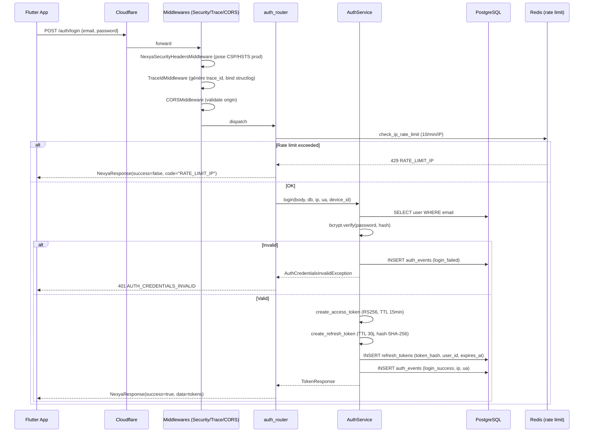
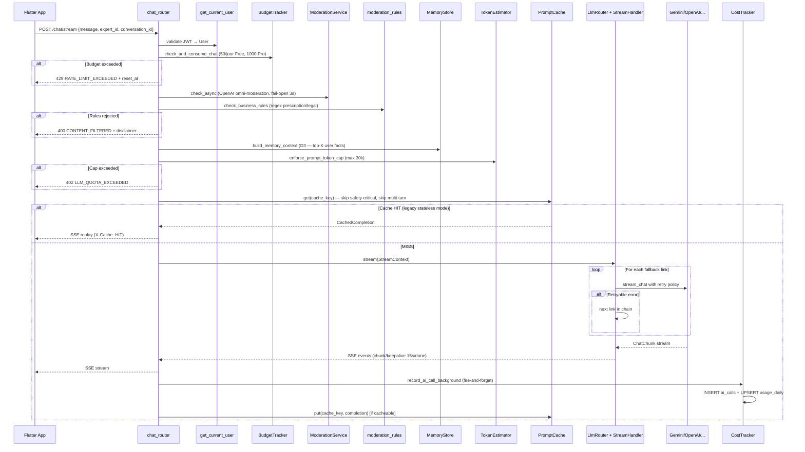
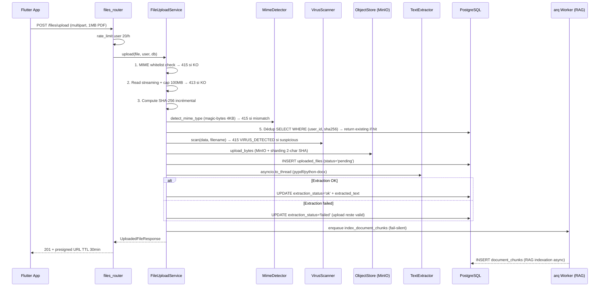
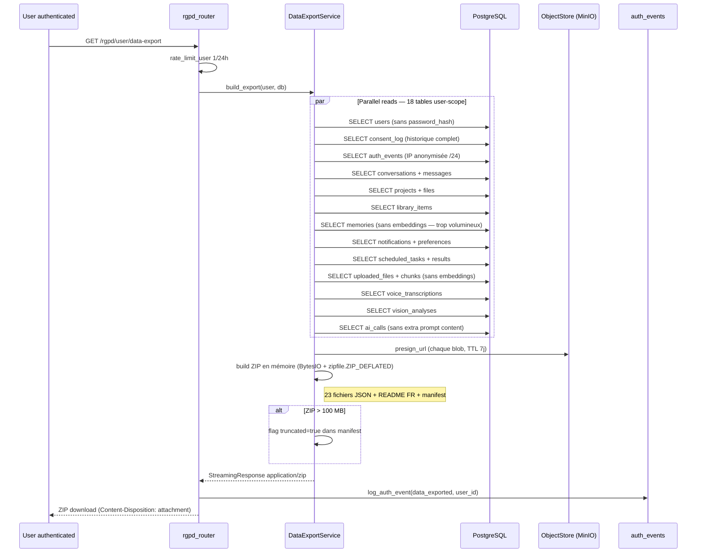

# Request Flow — NEXYA Backend

> **Executive summary (EN).** End-to-end request flow for the 4 most
> critical NEXYA endpoints: `POST /auth/login`, `POST /chat/stream`,
> `POST /files/upload`, `GET /rgpd/user/data-export`. Each flow shows
> middleware ordering, validation, business logic, persistence, and
> observability hooks. Sequence diagrams in Mermaid.

---

## 1. `POST /auth/login`

**Observabilité** : `auth_events` (forensic), trace_id corrélé dans tous
les logs structlog, OTel span auto-instrumenté FastAPI.

---

## 2. `POST /chat/stream` (le cœur du produit)

**Annulation duale** : Redis key `chat:cancel:{session_id}` posée par
`POST /chat/stop` OU déconnexion HTTP détectée par
`Request.is_disconnected()`. Le `StreamHandler` check ces 2 voies
toutes les 1-2s pendant le stream.

**Heartbeat** : `: keepalive` envoyé toutes les 15s pour éviter la
coupure des proxies 2G/3G après inactivité TCP.

**Cost tracking fire-and-forget** : `asyncio.create_task` lance
`CostTracker.record_ai_call` en arrière-plan — le SSE ne bloque
JAMAIS sur l'écriture DB. Si elle crash, on log warning.

---

## 3. `POST /files/upload`

**Anti-smuggling** : MIME annoncé vs détecté magic-bytes — si mismatch
(ex: client poste `.exe` avec `Content-Type: image/png`), 415
`FILE_CONTENT_MISMATCH` avant upload MinIO.

**Pipeline strict 10 étapes court-circuitantes** : un payload abusif
rejeté au step 1 (MIME hors whitelist) consomme ~0 ms vs upload puis
refus = ~100 MB disk + 200 ms CPU.

**Fail-safe extraction** : pypdf crash sur PDF corrompu ne casse PAS
l'upload. Status `failed` informatif, l'user garde son fichier.

---

## 4. `GET /rgpd/user/data-export`

**Conformité RGPD Article 20** : portabilité format structuré JSON
+ presigned URLs pour les blobs (alternative au base64 inline qui
ferait exploser le ZIP à 500 MB pour user lourd).

**Anti-leak** : 0 password_hash, 0 storage_key brut, IPs anonymisées
en /24 IPv4 ou /48 IPv6. Voir
[`docs/compliance/rgpd.md`](../compliance/rgpd.md).

---

## Patterns transverses

### Error handling global

Tous les `NexYaException` sont catchés par `nexya_exception_handler`
dans `app/core/errors/handlers.py` :
1. Log structlog avec trace_id
2. **Hook escalation Crisp** (Phase 18 / N4) si user Pro + payment/LLM
3. JSONResponse `NexyaResponse(success=false, code, message, data)`

### Audit trail
Toutes les actions sensibles (auth, RGPD, paiements) sont tracées dans
`auth_events` avec `event_type` + `user_id` + `ip` + `user_agent` +
`metadata_json`. FK `ON DELETE SET NULL` pour préserver post-purge user.

### Observabilité
Chaque request HTTP :
1. `TraceIdMiddleware` génère/propage `X-Request-ID`
2. `structlog.contextvars` bind `trace_id` → tous les logs corrélés
3. OTel auto-instrument FastAPI → span racine `http.server`
4. `OTLPSpanExporter` → collector externe (Jaeger/Tempo)
5. Prometheus métriques selon endpoint (`nexya_ai_*`, `nexya_arq_*`, etc.)

Voir [`observability.md`](observability.md) pour le détail.
